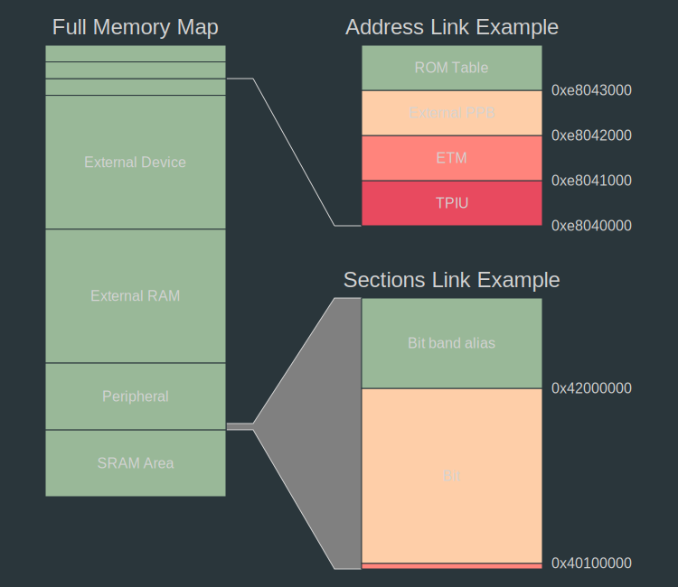
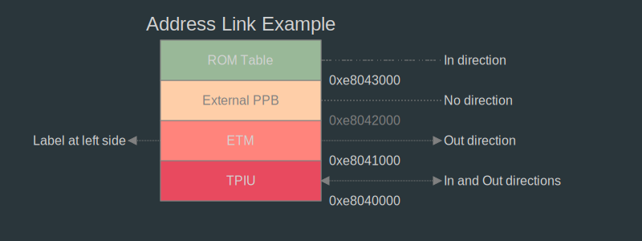
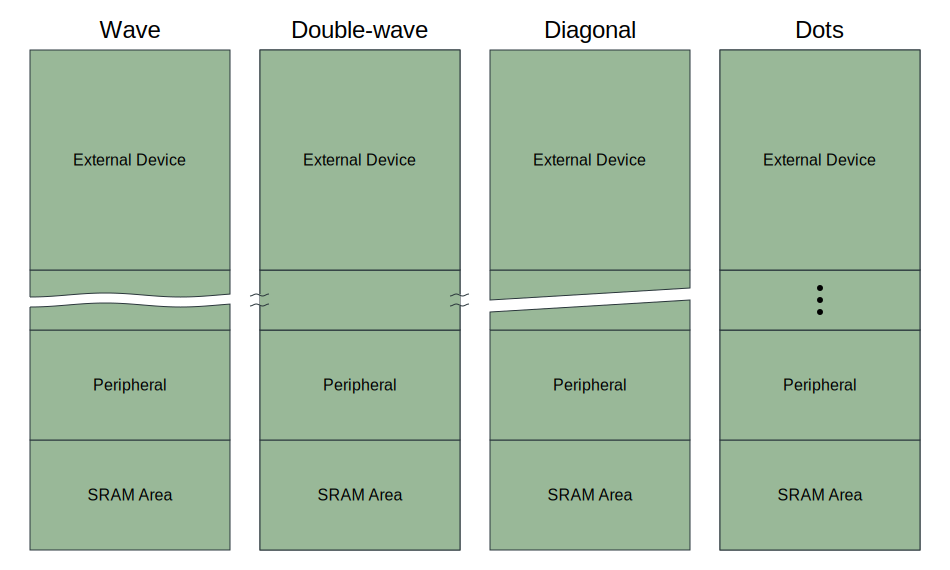

# LinkerScope

## Project summary

LinkerScope is a memory map diagram generator. It can be fed either with a GNU Linker map file or with a custom `yaml` file
and generate beautiful and detailed diagrams of the different areas and sections such as the one below.



## Installing LinkerScope

Optionally create and activate an environment for LinkerScope:

```bash
python3 -m venv venv
source env/bin/activate
```

Install the needed requirements by executing:

```bash
pip3 install -r requirements.txt
```

## Usage

### Execution

LinkerScope needs two inputs: a file with memory information (.map or .yaml) and a configuration file. Provide these two files and define an output map with:

```bash
./linkerscope.py --input linker.map --output map.svg --config config.yaml
```

where:
- `-i, --input` specifies the path to the input file, where LinkerScope should get the data to represent from. It can come from a GNU Linker map file `.map` or from an already parsed or hand-crafted `.yaml` file. Check [Manually crafting input file](#Manually crafting input file) section for learning how to do this.
- `-o, --output` specifies the path to the output file, which will be a newly generated SVG.
- `-c, --config` [OPTIONAL] specifies the path to the configuration file. This file contains all the custom information to tell LinkerScope what to and how to draw the memory maps. While it is optional, the default parameters will most likely not apply to a given use case.

### Input files

LinkerScope can use two types of input files: GNU linker map files (`.map`) or custom defined yaml files (`.yaml`).

#### Manually crafted memory map files

Custom memory map files can be manually crafted and can run from a couple of memory sections up to very complex memory schemes with hundreds of sections.
Normally you would do that when representing simple memory maps.

For making a memory map file, one has to specify at least a single section. Each section must include
an `id`, an `address` and a `size`.

While these three are needed, there are other possible attributes that are optional:

- `name`: Friendly text name that would be used instead of the `id`
- `type`: Section type, which can be used for different purposes. Current possibilities are `section` (default) and `area`.

The input file should contain the `map` keyword whose value is an array of sections. Below an example
of how an input file should look like:

```yaml
- address: 0x80045D4
  size:    0x0000F00
  id:      .rodata
  name:    Read Only Data
  type:    area
- address: 0x8002C3C
  id:      SysTick_Handler
  size:    0x0000008
- ...
```

In order to use this file, invoke LinkerScope and specify the yaml map file as input:

```bash
./linkerscope.py -i memory_map.yaml -o memory_map.svg -c config.yaml
```

### Creating a configuration file

The configuration file is a `.yaml` file containing all the required information to tell LinkerScope what and how to draw the memory map.
All information there is optional, including the file itself. If this information is not provided, the default values will be used.

Normally, a configuration file contains **areas**, **links** and **style** information.

**Areas** provides a list of memory areas to be displayed, with information regarding its position and size on the map, memory range to include or specific drawing style.
Additionally, it can contain a **sections** sub-property where specific sections can be added to modify desired properties

**Links** provides a simple way of graphically relating same memory addresses across different areas

**Style** defines the parent drawing style properties that will be used at the document. Additionally, each area can override specific style properties at its style section.
Lastly, sections can override parent (area) style as well

```yaml
style:
  background: '#99B898'
  stroke: 'black'
  # ...

areas:
- area:
    style:
    # ...
    title: Register Map
    range: [0x0, 0x100000000]
    sections:
      - names: [USART1, USART2]
        style:
          hide-name: true
    # ...
- area:
    # ...

links:
  addresses: [0x80045d4]
  sections: [__malloc_av_, [TIM2, TIM3]]

```

#### Areas

The diagram can have one or multiple areas. When multiple areas are declared,
first area has a special status since all links will start on it and go to the corresponding sections on the other areas
The areas are declared at root level under `areas`. Then each area must use the key `area`.
For each area, the following characteristics of an area can be defined:
- `title`:  **[Optional, none]**
  - The title of the area, which will appear on top of it
- `pos`:  **[Optional, (50, 50)]** **[x, y]**
  - absolute position  of the area's top-left corner in pixels
- `size`:  **[Optional, (300, 600)]** **[width, height]**
  - area size in pixels
- `range`:  **[Optional, (0, no limit)]** **[min, max]**
  - range of addresses that will be taken into account in this area. 
- `start`: **[start, end]** force area to start in to a given address
- `section-size`: **[Optional, (0, no limit)]** **[min, max]**
  - size range of the sections that should be shown. Exclude others.
- `style`:  **[Optional, default: parent style]**
  - specific style for current area. See [Styles](####Styles) section.
- `sections`: **[Optional, none]**
  - specify or modify a section or group of sections property such as `style`, `flags`,...
    - `names`:
      - list of one or more sections to modify with the parameters below
    - `flags`: **[Optional, none]**
      - flags to append to the specified section/s. See [Flags](#### Section flags) section.
    - `style`: **[Optional, parent style]**
      - style properties to or modify to the specified section/s
- `labels`: **[Optional, none]**
  - Add text labels to specific memory positions of the current area
    - `address`:
      - Memory address where the label should be placed
    - `text`:
      - Text to display for this label
    - `lenght`: **[Optional, none]**
      - lenght of the label line in pixels
    - `directions`: **[Optional, none]**
      - direction or list of directions for the arrow head. Possible values are none, `in`, `out` or both.
    - `side`: **[Optional, `right`]**
      - Area side at which the label should be placed
    - `style`: **[Optional, parent style]**
      - style properties to or modify to the specified section/s

Below an example of area definition:

```yaml
areas:
- area:
    title: 'Full Memory Map'
    pos: [30, 50]
    size: [300, 900]
    range: [0x0, 0x100000000]
    section-size: [0x02F00000]
    style:
      fill: *pastel_green
    sections:
    - names: [ External Device ]
      flags: grows-up
      style:
        hide-size: true
```
#### Labels

Labels can bind a text string with a specific memory position. This property falls inside `area`. A partial example can
be seen below:

```yaml
areas:
 - area:
    labels:
      - address: 0xe8043800
        text: In direction
        length: 150
        directions: in
        style:
          stroke-dasharray: '5,1,3,1,3'
     # ...
```



> See `examples/label_example_config.yaml` for a full example.

#### Section flags

Section flags allows to flag specified sections with special properties. These properties are listed below:

Flags are listed under property `flags` and can be specified both at the map files under each section

```yaml
# flags can be defined at map.yaml files under each section
map:
- address: 0x20000000
  id: stack
  # ...
  flags: grows-down, break
```

or at the configuration files, with the possibility to specify multiple sections at the same time:

```yaml
# flags can be defined at config.yaml files under each section or group of sections
areas:
- area:
  # ...
  sections:
  - names: [ROM Table, TPIU]
    flags: break
```

##### Growths
These flags specify the section as growing section, for instance, if the section is meant to grow into one direction, such as the stack.
When flagging a section with `grows-down`, an arrow pointing downwards will be appended to the bottom of the section indicating that the section is growing into that direction:


##### `break`

A break or discontinuous section shortens a sized section to a fixed size by drawing a symbol representing a discontinuity across it.
This is specially useful when wanting to include several sections of considerable different sizes in one diagram.
Reducing the size of the biggest one helps to visually simplify the diagram and evenly distribute the space.

There are four different break styles, which can be defined by the 'break-type' style property: `~`: Wave,  `≈`: Double wave, `/`: Diagonal, `...`: Dots



#### Links

Links establish a connection between same addresses or sections at different areas.

While address links are represented with a finite line between the addresses, section link drawing
cover the whole region space. These can be used, for instance, to represent a _zoom_ in effects from one overview area
to other area with more detail.

> When drawing a section link, Linkerscope expects both start and end section addresses to be visible at both intended areas.
If any of those is not present, the link will not be drawn

Links are defined at root level of the configuration file under the `links` tag.
Links must have either `addresses` or `sections` tags or both.
- `addresses` is a list of integers representing memory addresses
- `sections` is a list whose elements can be either single section id's, section id's pairs (as a sublist) or both.
  When using pairs, the first element should be the one with the lowest memory address. 
Additionally, specific styles can be specified under the `style` tag.


```yaml
links:
  style:
    stroke: 'lightgray'
    stroke-width: 1
    fill: 'gray'
  addresses: [ 0xe8040000, 0xe8042000 ]
  sections: [['Bit band region', 'Bit band alias'],'ITM']

```


#### Styles

The style can be defined at document level, where it will be applied to all areas, but also at area or even at section level.
Specifying a style at area level will override the specified properties for the whole area where it was defined.
Specifying it at section level, it will override style only for the specified section or group of sections. 

```yaml
style:
  # This is a style defined at document level
  text-fill: 'lightgrey'
  background: 'black'
  stroke: '#99B898'
  stroke-width: 1
  font-type: 'Helvetica'

areas:
- area:
    title: 'Internal Memory'
    pos: [30, 50]
    style:
      # This is a style defined at area level, which will override fill property only applied at Main Memory area
      fill: 'blue'
    sections:
    - names: [ SRAM, Flash ]
      style:
        # This is a style defined at section level, and will be applied only to SRAM and Flash sections
        fill: 'green'
        hide-address: true
- area:
    title: 'External Memory'
    # ...
```

Below a list of style properties with general use and specific for sections:
##### General
  - `background`, `fill`, `font-size`, `font-type`, `opacity`, `size`, `stroke`, `stroke_dasharray`, `stroke-width`, `text-stroke`,`text-fill`,`text-stroke-width`, `weight`

##### Section properties:
  - `break-type`: specify memory break type. See [`break`](#break) section
  - `break-size`: specify memory break size in pixels. See [`break`](#break) section
  - `growth-arrow-size`: size of the direction growth arrow. See [`Growths`](#growths) section
  - `growth-arrow-fill`: color for the direction growth arrow. See [`Growths`](#growths) section
  - `growth-arrow-stroke`: stroke color for the direction growth arrow. See [`Growths`](#growths) section
  - `hide-size`: hides the size label of a section
  - `hide-name`: hides the name label of a section
  - `hide-address`: hides the address label of a section

#### Other properties

_Document size_

The generated SVG document has a fixed size. If you want to adjust it, use the `size` property at root level to pass
desired document width and height in pixels.

## Run some examples with LinkerScope

At the folder examples, there are a series of configurations and map `.yaml` files you can use to get a preview of what LinkerScope can do.

## Roadmap

- [x] Labels at specific memory addresses
- [x] Area titles
- [x] Links across specific areas
- [x] Choose side of the labels
- [x] Memory direction
- [x] Hide specific elements
- [ ] Memory size in bytes
- [x] Section links across breaks
- [x] Friendly name and identifier
- [ ] Legend
- [ ] Area representation different from section
- [ ] Make `type` default to `section`
- [x] Bug: title appears at top of each break section, if long enough

## References

- [YAML cheatsheet](https://quickref.me/yaml)
- [MapViewer](https://github.com/govind-mukundan/MapViewer)
- [LinkerMapViz](https://github.com/PromyLOPh/linkermapviz)

## License

Distributed under the MIT License. See `LICENSE` for more information.
